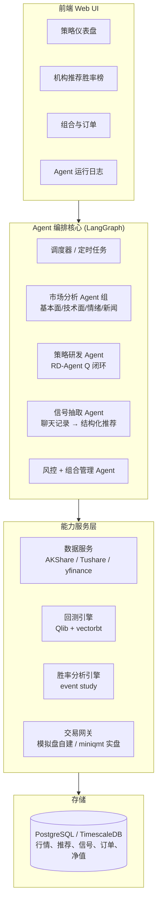
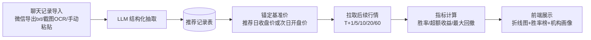

# 个人投资研究软件 —— 产品分析与技术方案

> 结论先行:这个软件应该以 **Agent 自动化平台为核心**(即你提出的第 3 点),其余三个功能(模拟/实盘交易、自我改进量化研究、外部推荐胜率追踪)都作为挂在这个平台上的"能力模块"来实现。四个功能中,**第 4 点(外部机构推荐的胜率追踪)是市面上没有现成产品的差异化功能,应该最先做**;其余三个功能都有成熟开源框架可以直接集成,不要自研。

---

## 一、需求拆解

| # | 原始需求 | 本质 | 建议做法 |
|---|---------|------|---------|
| 1 | 直接投资或模拟投资股票 | 交易执行层(模拟盘 + 实盘) | 自建轻量模拟盘(paper trading),实盘通过券商官方量化接口(miniqmt)或 easytrader 接入,**不自研交易通道** |
| 2 | 自我改进地研究多种量化策略 | 策略研发的自动化闭环:假设 → 写因子/模型 → 回测 → 反馈 → 迭代 | 直接集成微软 **RD-Agent(Q)**(NeurIPS 2025,开源),底座用 **Qlib** 做因子库与回测 |
| 3 | 接入 agent / 以 agent 平台为核心 | 系统架构定位 | **采纳为核心架构**:用 LangGraph 编排多智能体,参考/复用 **TradingAgents** 的分析师-研究员-交易员-风控角色分工 |
| 4 | 实时检测外部机构推荐,回溯胜率 | 信号抽取 + 事件研究(event study) | **自研核心模块**:LLM 解析聊天记录 → 锚定推荐日股价 → 拉取后续行情 → 计算胜率/收益分布/折线图 |

---

## 二、核心定位:Agent 自动化平台

你的第 3 点直觉是对的,理由:

1. **四个功能天然共享同一套底座**:行情数据、回测引擎、股票池、决策日志。用 agent 平台统一编排,每个功能就是一个(或一组)agent + 若干工具(tool)。
2. **功能 2 和功能 4 本身就是 agent 任务**:RD-Agent(Q) 是多智能体研发闭环;聊天记录解析靠 LLM 结构化抽取,天然是 agent 工具调用。
3. **可解释性**:个人投研最怕黑箱。多智能体的辩论/报告式输出(TradingAgents 模式:基本面分析师、情绪分析师、技术分析师、多空研究员辩论、交易员、风控)给出的是**带理由的建议**,而不是一个信号数字。

### 系统架构



---

## 三、技术选型(不重复造轮子)

### 3.1 数据层

| 用途 | 选型 | 说明 |
|------|------|------|
| A 股日线/分钟线/实时 | **AKShare**(首选,完全免费) | 爬虫聚合,稳定性一般,需做重试与数据源冗余 |
| A 股备用/更稳定 | **Tushare Pro** | 积分制,基础日线免费;把 AKShare 和 Tushare 封装成同一接口,可开关切换 |
| 美股/港股 | **yfinance** / AKShare 美股接口 | 免费够用 |
| 存储 | **PostgreSQL + TimescaleDB** | 行情是时序数据;个人规模单机足够,不需要专门的行情数据库 |

关键点:所有行情**入库缓存**,一次拉取反复使用——功能 4 的历史回溯会高频查询同一批股票的历史 K 线,不能每次都打外部 API。

### 3.2 量化研究与回测(功能 2)

- **Qlib**(微软,44k+ stars):AI 量化研究平台,内置 Alpha158/Alpha360 因子库、LightGBM/LSTM/Transformer 等模型、完整回测。做 ML 选股与因子挖掘的事实标准。
- **RD-Agent(Q)**(微软,开源,NeurIPS 2025):**正好就是"自我改进地研究量化策略"这件事本身**——它把量化研发拆成 Research(生成假设)与 Development(Co-STEER 写代码)两个阶段,接 Qlib 回测,用多臂老虎机调度器决定下一轮优化因子还是优化模型,形成"假设 → 代码 → 回测 → 反馈"的自动闭环。论文数据:比经典因子库年化收益高约 2 倍,因子数少 70%,单轮优化成本 < $10。
- **vectorbt**:补充快速向量化回测,用于功能 4 的批量胜率计算和简单规则策略的秒级验证(Qlib 偏重 ML 流水线,对"简单规则快速验证"太重)。
- 不选 Backtrader(2019 年起停止维护)。

### 3.3 Agent 层(功能 3)

- **编排框架:LangGraph**。TradingAgents(85k+ stars)就是用它构建的,生态成熟,支持 OpenAI/Anthropic/DeepSeek/Qwen/Ollama 本地模型等几乎所有主流 LLM。
- **参考/直接复用 TradingAgents** 的角色设计:分析师团队(基本面/情绪/新闻/技术)→ 多空研究员辩论 → 交易员 → 风控团队 → 组合经理审批。它自带回测框架(按日期网格跑 agent,输出 Sharpe、hit rate、回撤)。
- 每个功能模块注册为平台上的 agent 或 tool,统一由调度器(cron + 事件触发)驱动:开盘前跑分析、盘中监听新推荐、收盘后跑研发闭环与净值结算。

### 3.4 交易执行(功能 1)

- **模拟盘:自建**。这是全系统唯一值得从零写的基础设施之一,因为它必须与你自己的数据库和 agent 决策日志深度耦合:虚拟账户、按次日开盘价/当日收盘价成交、手续费与滑点模型、持仓与净值曲线。工作量小(一张订单表 + 一张持仓表 + 每日结算任务)。
- **实盘:券商官方接口优先**。A 股个人可用的现实路径:
  - **miniqmt**(券商官方量化接口,easytrader 已封装)——首选;
  - easytrader 的同花顺客户端模拟操作——备选,依赖 GUI 控件,维护成本高;
  - 美股可用 Alpaca 等 API 券商。
- **强烈建议:所有 agent 产生的实盘指令默认进入"待确认"队列,人工点击后才下单**。个人软件不要做全自动实盘,合规和资金安全风险都太大。

### 3.5 外部推荐胜率追踪(功能 4,差异化核心)

这是四个功能里唯一没有现成开源实现的,也是你描述最具体的需求,详见下一节。

---

## 四、功能 4 详细设计:机构推荐胜率追踪

### 4.1 流水线



### 4.2 LLM 结构化抽取(关键步骤)

输入:聊天记录文本(微信导出的 txt、截图 OCR 结果、或手动粘贴)。
输出:每条推荐的结构化 JSON:

```json
{
  "source": "XX投顾-老师A",
  "message_time": "2026-07-15 09:21",
  "symbol": "600519.SH",
  "symbol_name": "贵州茅台",
  "action": "buy",
  "reason": "白酒旺季提价预期",
  "target_price": 1900.0,
  "stop_loss": 1650.0,
  "horizon": "short",
  "confidence": "explicit",
  "raw_text": "今天重点关注茅台,建议逢低吸纳,目标1900"
}
```

工程要点:

- **股票名 → 代码消歧**:维护全市场"名称/简称/常见口语别名 → 代码"映射表(AKShare 可拉全量股票列表),LLM 抽取名称后本地匹配,而不是让 LLM 猜代码(LLM 编造股票代码是高频错误)。
- **区分"推荐"和"闲聊提及"**:prompt 里要求输出 `confidence`(明确建议 / 顺带提及 / 复盘旧票),只有明确建议进入胜率统计,避免污染样本。
- **时间锚定规则要固定且保守**:盘中推荐 → 用**当日收盘价**为基准(你看到消息也来不及按推荐瞬间价格成交);收盘后推荐 → 用**次日开盘价**。规则写死并在 UI 上标注,否则胜率数字没有可比性。

### 4.3 胜率与绩效计算(event study)

对每条推荐,以基准价为 100%,计算 T+1、T+3、T+5、T+10、T+20、T+60 的:

- **绝对收益** 与 **相对基准指数(沪深300)的超额收益**——这一点很重要:牛市里人人推荐都"赚钱",只有超额收益才能识别机构真实水平;
- **胜率**:收益 > 0(以及超额收益 > 0)的比例,按时间窗口分别统计;
- **持有期最大回撤 / 最大浮盈**:识别"推荐后先砸 20% 再回来"这类体验极差的推荐;
- 若推荐含目标价/止损价:统计**先触达目标还是先触达止损**。

聚合维度:按机构、按"老师"、按月份、按行业、按市场风格阶段,输出机构画像:"该机构近 6 个月推荐 87 次,T+5 胜率 43%,T+20 超额收益中位数 -1.2%"。

历史回溯:同一条流水线直接吃历史聊天记录导出文件,一次性把过去几年的推荐全部入库回算——**这个功能上线第一天就能对你现有的所有机构给出历史成绩单**。

### 4.4 前端展示

- 每条推荐一张卡片:推荐日打竖线标记的**股价折线图**(基准价归一化,叠加沪深300 同期走势),标注 T+N 收益;
- 机构排行榜:按胜率/超额收益排序,可按时间窗口切换;
- "实时检测":新聊天记录导入后自动增量解析,新推荐当天入库,之后每日收盘任务自动更新其净值轨迹。

### 4.5 与 Agent 平台的联动

胜率数据回流给决策 agent:交易员 agent 在评估某只股票时,可以调用工具查询"这只票最近被哪些机构推荐过、这些机构的历史胜率如何",把外部信号的**可信度加权**纳入决策——这是四个功能真正串起来的地方。

---

## 五、数据模型(核心表)

| 表 | 关键字段 |
|----|---------|
| `instruments` | 代码、名称、别名列表、交易所、行业 |
| `daily_bars` | 代码、日期、OHLCV、复权因子(TimescaleDB hypertable) |
| `sources` | 机构/老师 ID、名称、渠道 |
| `recommendations` | 来源、消息时间、代码、方向、目标价/止损、原文、置信级别、基准价、基准日 |
| `rec_performance` | 推荐 ID、窗口(T+N)、收益、超额收益、期间最大回撤、是否触达目标/止损 |
| `strategies` | 策略 ID、类型(规则/ML/agent)、参数、版本、来源(手写/RD-Agent 生成) |
| `signals` | 策略 ID、日期、代码、方向、建议仓位、理由(agent 报告全文) |
| `orders` / `positions` / `nav` | 模拟与实盘共用,`account_type` 区分 |

---

## 六、实施路线(按依赖顺序,不按日历)

**阶段 0 —— 底座**:Python monorepo;数据服务(AKShare 封装 + 入库缓存 + Tushare 冗余);PostgreSQL/TimescaleDB;FastAPI 后端 + React/Next.js 前端骨架;每日收盘数据同步任务。

**阶段 1 —— 功能 4(推荐胜率追踪)**:LLM 抽取流水线 → 推荐入库 → event study 计算 → 折线图与排行榜。*理由:差异化最强、依赖最少(只需要数据层)、你有现成的聊天记录可以立刻产生价值。*

**阶段 2 —— 功能 1(模拟盘)**:虚拟账户、订单撮合规则、每日结算与净值曲线。此时所有后续策略都有了统一的"成绩单"载体。

**阶段 3 —— 功能 3(Agent 决策层)**:接入 LangGraph + TradingAgents 角色体系,先让 agent 只在模拟盘操作;把功能 4 的机构胜率数据注册为 agent 工具。

**阶段 4 —— 功能 2(自我改进研发)**:部署 Qlib(A 股数据集)+ RD-Agent(Q),让研发闭环产出的策略自动注册进策略库,在模拟盘上跑对照实验。

**阶段 5 —— 实盘(可选)**:miniqmt 接入,人工确认队列,小资金灰度。

---

## 七、风险与注意事项

1. **数据质量是功能 4 的命门**:必须使用**前复权**价格计算收益,否则除权除息日会产生虚假暴跌;停牌期间的推荐需特殊处理(基准价顺延到复牌日)。
2. **免费数据源的稳定性**:AKShare 依赖爬虫,会被封 IP/接口变更;必须做多源冗余 + 本地缓存,把外部依赖压到每天一次批量同步。
3. **LLM 抽取需要抽检**:上线初期人工抽查抽取结果(尤其是股票消歧和"推荐 vs 提及"的判断),把错误案例回填到 prompt 的 few-shot 里。
4. **回测幻觉**:TradingAgents/RD-Agent 论文里的收益率不可直接外推,回测与实盘之间有滑点、冲击成本、市场风格切换的鸿沟;所有策略先在模拟盘跑够样本再谈实盘。
5. **合规**:该软件仅供个人研究;机构推荐的胜率分析结果不要对外传播(可能涉及对投顾机构的公开评价与荐股合规问题);A 股程序化交易需遵守 2025 年起实施的程序化交易管理规定,个人自动化下单需通过券商合规通道(miniqmt 即为此类)。
6. **LLM 成本控制**:功能 4 的抽取用便宜的模型(DeepSeek/Qwen)即可;TradingAgents 多智能体辩论每次运行消耗较大,建议只对候选池(而非全市场)运行,并支持 Ollama 本地模型兜底。
