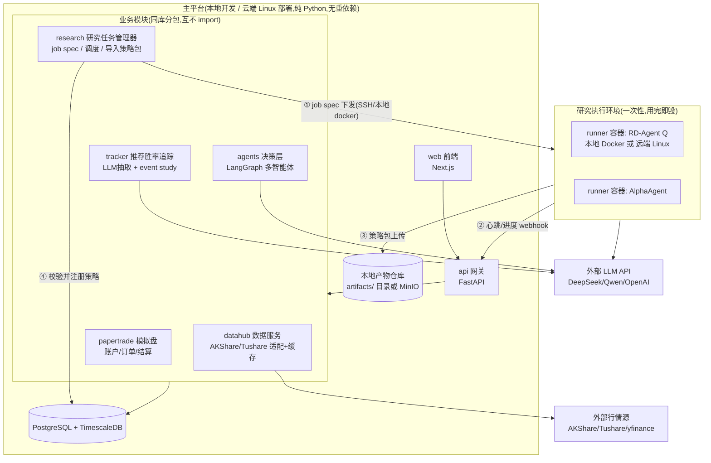
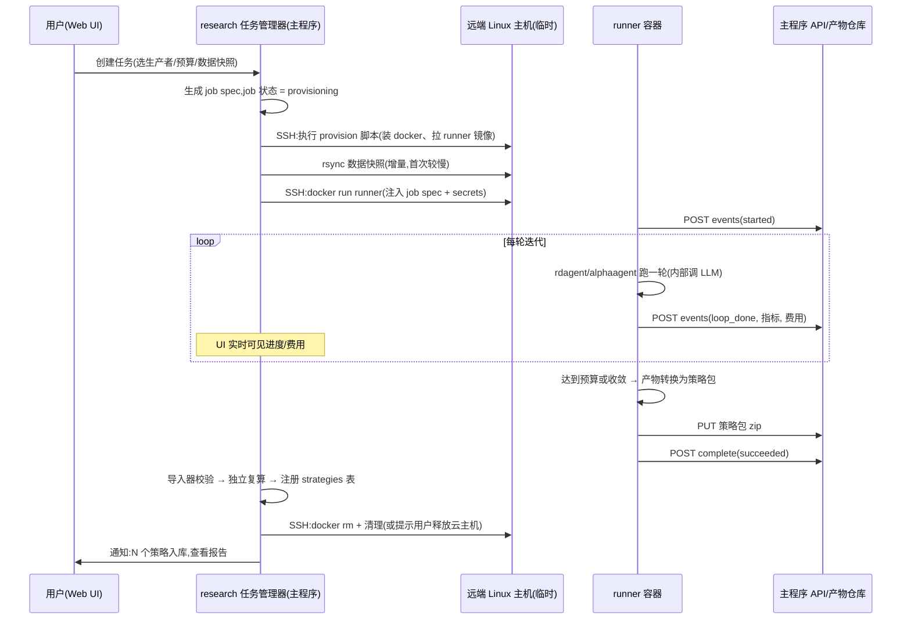

# 架构设计

> 本文档承接 `docs/analysis.md` 的产品分析结论,给出可落地的系统架构说明。
>
> 三条硬约束:
> 1. **组件间低耦合**——任何一个模块(尤其是 RD-Agent 等研究引擎)可以整体移除或替换,不影响其余功能;
> 2. **主力开发在本地工作站**——主平台全部代码原生跑在 macOS(Apple Silicon)上,不依赖 Linux 专属组件;需要 RD-Agent 时在 Docker 容器(或远端)运行;
> 3. **可迁移、可远程**——测试通过后整体部署到 Linux 云服务器;支持在远端临时拉起研究任务(RD-Agent/AlphaAgent),任务结束后自动把产物与结果汇报给主程序,随后销毁远端环境。

---

## 一、总体架构

### 1.1 设计原则

| 原则 | 具体做法 |
|------|---------|
| 契约优先 | 组件之间只通过三样东西交互:**数据库表、HTTP API、文件契约(策略包/任务规格)**。禁止跨模块 import 内部实现 |
| 重依赖隔离 | Qlib、RD-Agent、AlphaAgent 及其 Docker 镜像**只存在于 research runner 容器内**,主平台的 Python 环境永远不安装它们,开发机上 `pip install` 不会碰到任何 Linux 专属包 |
| 策略生产者可插拔 | RD-Agent、AlphaAgent、手写策略、未来任何新工具,都只是"策略包"的生产者。主平台只认策略包格式,不认生产者 |
| 异步任务松耦合 | 研究任务通过 job spec 下发、webhook + 轮询兜底回报,主程序与 runner 之间无长连接、无共享状态 |
| 单机可跑 | 整个平台一条 `docker compose up` 起全部服务;不引入 k8s、消息队列等个人项目用不到的基础设施 |

### 1.2 组件总览



关键点:主平台(上半部分)与 runner(下半部分)之间**没有任何代码依赖**,只有三个箭头:任务规格下发、HTTP 回报、产物文件上传。runner 死了、丢了、换了实现,主平台无感。

### 1.3 仓库结构(monorepo,uv workspace)

```
signal/
├── apps/
│   ├── api/                  # FastAPI 主服务(组装各业务包,唯一的进程入口)
│   └── web/                  # Next.js 前端
├── packages/
│   ├── contracts/            # ★ 唯一允许被所有包共享的包:pydantic 模型、
│   │                         #   策略包 spec、研究任务 spec、webhook 协议、常量
│   ├── datahub/              # 数据服务:行情适配器、入库缓存、每日同步任务
│   ├── tracker/              # 功能4:聊天记录抽取、event study、机构画像
│   ├── papertrade/           # 功能1:虚拟账户、订单撮合、每日结算、净值
│   ├── agents/               # 功能3:LangGraph 编排、角色 prompt、工具注册
│   └── research/             # 功能2:任务管理器、runner 供给器(local/ssh)、
│                             #   策略包导入校验器 —— 注意:不含任何 qlib/rdagent 代码
├── runners/                  # 研究执行环境(独立于主平台,不进主平台依赖树)
│   ├── common/               # runner 通用脚本:心跳上报、产物打包、上传
│   ├── rdagent/              # Dockerfile + 启动脚本 + 产物转换(→策略包)
│   └── alphaagent/           # 同上
├── deploy/
│   ├── docker-compose.dev.yml    # Mac 开发:pg+timescale(+minio 可选)
│   ├── docker-compose.prod.yml   # 云端:全部服务容器化
│   └── provision/                # 远端 runner 主机的一键供给脚本(cloud-init/shell)
├── docs/
└── pyproject.toml            # uv workspace 根
```

依赖规则(用 import-linter 在 CI 强制):

- `contracts` 不依赖任何业务包;
- 业务包只能依赖 `contracts`,**互相之间禁止 import**(跨模块协作走 DB 或 API 内部调用);
- `runners/*` 完全脱离 workspace,有自己的 Dockerfile 和依赖,主平台 CI 不构建它们的镜像也能通过;
- `apps/api` 是唯一允许 import 所有业务包的地方(组装层)。

### 1.4 数据流与模块边界

各模块对数据库的读写权限(逻辑上的所有权,物理上同一个库):

| 表 | 所有者(唯一写入方) | 读取方 |
|----|-----------------|--------|
| `instruments` / `daily_bars` | datahub | 所有模块 |
| `sources` / `recommendations` / `rec_performance` | tracker | agents(作为工具查询)、web |
| `accounts` / `orders` / `positions` / `nav` | papertrade | agents、web |
| `strategies` / `signals` | research(注册)、agents(产信号) | papertrade(执行)、web |
| `research_jobs` / `research_events` | research | web |

这个"单写多读"规则是低耦合的核心:任何模块坏了,别的模块最多是读到旧数据,不会写坏彼此。

---

## 二、核心契约(contracts 包)

契约是全系统唯一的耦合点,所以单独设计。三份契约都带 `schema_version` 字段,向后兼容演进。

### 2.1 策略包(Strategy Package)

策略生产者(RD-Agent / AlphaAgent / 手写)与主平台之间的唯一接口。一个 zip/目录:

```
strategy_pkg_<id>/
├── manifest.json          # 见下
├── factors/               # 因子:Qlib 表达式(.txt)或独立 python 文件
│   ├── factor_001.json    #   { name, expression | code_file, description, hypothesis }
│   └── ...
├── model/                 # 可选:模型配置 + checkpoint(LightGBM .txt / torch .pt)
│   └── config.yaml
├── report/
│   ├── metrics.json       # IC/ICIR/年化/回撤/换手,含回测区间与数据快照版本
│   └── backtest_report.html
└── README.md              # 生产者自动生成的策略说明(假设、迭代历史摘要)
```

`manifest.json` 要点:

```json
{
  "schema_version": "1.0",
  "package_id": "uuid",
  "producer": "rdagent@0.8.0 | alphaagent@x.y | manual",
  "created_at": "...",
  "data_snapshot": "qlib_cn_20260718",
  "universe": "csi300",
  "metrics_summary": {"ic": 0.05, "arr": 0.14, "mdd": -0.07},
  "signal_protocol": "qlib_expression | python_module"
}
```

导入器(research 包内)对策略包做三步校验后写入 `strategies` 表:格式校验 → 因子表达式在主平台侧用 vectorbt/自有数据**独立复算一遍抽样区间**(防 runner 侧回测造假/数据泄漏)→ 指标达标准入。

**信号执行说明**:入库后策略的日常信号计算由主平台完成。`qlib_expression` 类型的因子表达式用一个轻量表达式解释器(自研,仅支持常用算子集)在 pandas 上求值,不需要安装 Qlib;`python_module` 类型在受限子进程中执行。这样主平台在 主平台保持零重依赖。

### 2.2 研究任务规格(Research Job Spec)

```json
{
  "schema_version": "1.0",
  "job_id": "uuid",
  "producer": "rdagent",
  "scenario": "fin_factor",
  "runner_target": {
    "type": "local_docker | remote_ssh",
    "host": "1.2.3.4", "user": "ubuntu", "key_ref": "env:RUNNER_SSH_KEY"
  },
  "llm": {"provider": "deepseek", "model": "deepseek-chat", "key_ref": "env:DEEPSEEK_KEY"},
  "budget": {"max_loops": 20, "max_hours": 12, "max_llm_cost_usd": 15},
  "data_snapshot": "qlib_cn_20260718",
  "callback": {
    "base_url": "https://<主程序>/api/research/jobs/<job_id>",
    "hmac_key_ref": "env:RUNNER_CALLBACK_SECRET"
  },
  "artifact_upload": {"type": "http_put | scp", "url": "..."}
}
```

### 2.3 回报协议(Runner → 主程序)

runner 里的通用脚本(`runners/common/reporter.py`)负责所有对外通信,与具体研究工具无关:

- `POST {base_url}/events` —— 心跳与进度事件,每 5 分钟或每轮迭代结束时上报:`{"type": "heartbeat|loop_done|error", "loop": 7, "best_ic": 0.041, "llm_cost_usd": 3.2}`,HMAC 签名;
- `PUT artifact_upload.url` —— 任务结束(成功或达到预算上限)上传策略包 zip;
- `POST {base_url}/complete` —— 终态汇报:`{"status": "succeeded|failed|budget_exceeded", "package_id": "...", "summary": {...}}`。

**可靠性兜底**(webhook 可能丢):research 任务管理器对每个 running 状态的 job 定期主动探测——local_docker 用 `docker inspect`,remote_ssh 用 SSH 查 runner 容器状态与本地状态文件;超过 2 个心跳周期无响应标记为 `lost`,可一键重试。runner 侧所有事件先写本地 `events.jsonl` 再发送,重试 3 次失败后留在文件里,探测时由管理器拉回补账。

---

## 三、研究任务全生命周期(远程临时部署)

这是你特别提出的场景:平时不养 Linux 机器,要跑研发实验时临时开一台云主机,跑完汇报、销毁。



设计说明:

1. **主机供给不自动开云主机**(第一版):用户自己在云厂商开一台 Ubuntu 按量机器,把 IP 填进任务表单;`deploy/provision/` 脚本负责从裸机到可运行(装 Docker、配镜像源、拉镜像)一条命令完成。后续如有需要再加某个云厂商的 API 自动开机/释放,属于锦上添花。
2. **数据快照单向下发**:runner 需要的 Qlib 格式数据由主平台的 datahub 定期导出为版本化快照(`qlib_cn_YYYYMMDD`),rsync 到远端。runner 永远不直接连主平台数据库。
3. **secrets 不落盘**:LLM key、回调 HMAC key 通过 SSH 会话环境变量注入容器,provision 脚本不写入远端磁盘。
4. **local_docker 与 remote_ssh 同构**:本地 Docker 跑 runner(本地冒烟测试用)走完全相同的 spec 和回报协议,只是供给器不同。开发期在 本地用小预算(2~3 轮迭代)验证全链路,真实验证再上远端。
5. **本地跑 RD-Agent 的定位是冒烟测试**:RD-Agent 官方只支持 Linux,其镜像为 linux/amd64,Apple Silicon 上走 QEMU 模拟,慢且偶发不稳,所以 Mac 本地只跑"1~2 轮迭代、能出策略包"级别的验证;AlphaAgent 支持 `USE_LOCAL=True`,必要时可在本地原生跑通更多轮。正式研究一律 remote_ssh。

---

## 四、各模块设计要点

### 4.1 datahub(数据服务)

- 适配器模式:`BarProvider` 接口 + `AkshareProvider` / `TushareProvider` / `YfinanceProvider` 实现,配置决定主备顺序,失败自动降级;
- 所有行情**先入库后使用**(TimescaleDB hypertable,前复权因子单独存),对外只暴露"读库"接口,外部 API 的不稳定被隔离在每日同步任务里;
- 两个产出:① 给主平台各模块的行情读取 API;② 给 runner 的 Qlib 格式快照导出器(dump_bin,独立脚本跑在容器里,不污染主环境);
- 定时任务用 APScheduler(进程内),不引入 celery。

### 4.2 tracker(功能4:推荐胜率追踪)

按 `analysis.md` 第四节实施,补充工程决策:

- 抽取用 LLM 走 OpenAI 兼容接口(instructor/structured output),模型可配(默认 DeepSeek,便宜);
- 股票消歧在本地做:`instruments` 表含别名列;LLM 只输出名称,代码匹配由确定性代码完成;
- event study 计算用 pandas 向量化批量算,结果落 `rec_performance` 表,幂等可重算;
- 导入渠道第一版做两个:微信导出 txt 解析、手动粘贴;OCR 后置。

### 4.3 papertrade(功能1:模拟盘)

- 撮合规则简单确定:信号 → 次日开盘价成交,手续费/滑点可配;
- 收盘后结算任务更新持仓市值与净值曲线;
- 实盘接口(miniqmt)后置到云端部署之后,且默认人工确认队列。

### 4.4 agents(功能3:决策层)

- LangGraph 编排,角色参考 TradingAgents(分析师组 → 多空辩论 → 交易员 → 风控);
- 所有对内能力封装成 tool:`get_bars`、`get_rec_stats`(tracker 的机构胜率)、`get_positions`、`place_paper_order`、`get_strategy_signals`;
- agent 只对**候选池**运行(自选股 + 近期被推荐股票),控制 LLM 费用;
- 每次运行的完整报告(各角色发言)存 `signals.reason`,前端可回放。

### 4.5 research(功能2:研究任务管理)

- 主平台侧只有四样东西:job spec 的 CRUD、供给器(local_docker / remote_ssh,各约百行代码,用 paramiko/subprocess)、事件接收 endpoint、策略包导入校验器;
- **绝不 import qlib/rdagent**;
- 导入校验器里的"独立复算"用 vectorbt + 自有 daily_bars 抽样验证因子方向性,与 runner 侧的 Qlib 回测互为交叉验证。

### 4.6 runners(研究执行环境)

- 每个生产者一个目录:Dockerfile(固定 rdagent/alphaagent 版本 tag)+ `entrypoint.sh` + `to_package.py`(把该工具的原生产出转换成策略包格式);
- `runners/common/` 提供 reporter(心跳/上传/终态)与 budget guard(监控迭代数/时长/LLM 费用,超限优雅终止并打包已有成果);
- 镜像构建在 Linux CI 或远端主机上做(`docker build` 一次,推到 registry 或直接在远端 build),开发机不强制能构建。

---

## 五、部署形态演进

| 阶段 | 主平台 | 数据库 | runner | 说明 |
|------|--------|--------|--------|------|
| 开发期 | 本地原生进程(uv run) | 本地 Docker 起 pg+timescale | 本地 Docker 冒烟 / 远端按需 | 日常状态 |
| 集成测试 | 本地 `docker compose -f dev` 全容器化 | 同上 | 远端按需 | 验证容器化正确性 |
| 生产 | Linux 云服务器 `docker compose -f prod` | 同机容器 + 每日备份到对象存储 | 远端按需(可与主机同厂商内网) | 加 Caddy 反代 + HTTPS + Basic Auth |

迁移成本被 compose 文件锁定:开发期就用 compose 管依赖服务,上云只是换一台机器执行同一份文件。云端与本地开发环境的唯一差异收敛在 `.env`。

---

## 七、技术栈清单

| 层 | 选型 | 备注 |
|----|------|------|
| 语言/包管理 | Python 3.12 + uv workspace;TypeScript | |
| 后端 | FastAPI + SQLAlchemy + Alembic + APScheduler | 单进程,不引入 celery/redis |
| 数据库 | PostgreSQL 16 + TimescaleDB | Docker 容器 |
| 前端 | Next.js + shadcn/ui + ECharts | ECharts 对 K 线/折线标注支持好 |
| 行情 | AKShare(主)/ Tushare(备)/ yfinance | 适配器模式 |
| 回测(主平台侧) | vectorbt | 轻量,用于功能4批量计算与策略包复算 |
| Agent | LangGraph + OpenAI 兼容接口 | DeepSeek/Qwen 控成本,Ollama 兜底 |
| 结构化抽取 | instructor(或原生 structured output) | |
| 研究引擎(容器内) | RD-Agent(Q)、AlphaAgent(均基于 Qlib) | 版本 tag 固定,只活在 runner 镜像里 |
| 远程执行 | paramiko/plain ssh + rsync | 不引入 ansible/k8s |
| 部署 | Docker Compose + Caddy | |
| CI | GitHub Actions:lint(ruff)+ 类型(pyright)+ 测试(pytest)+ import-linter | |

---

## 八、风险与应对(增量部分)

1. **Apple Silicon 上 runner 冒烟不稳**(QEMU 模拟 amd64):可接受——冒烟测试改在远端小机器上做,或用 AlphaAgent 本地模式替代冒烟;架构上没有任何环节强依赖"本地能跑 runner"。
2. **Qlib 快照与主平台 daily_bars 口径不一致**(复权方式差异):快照导出器与 event study 强制同一份复权因子表,并在 CI 里放一个双向抽样对账测试。
3. **runner 侧 LLM 费用失控**:budget guard 在 runner 内部计费并强制停止;job spec 的 `max_llm_cost_usd` 是硬上限;UI 实时显示。
4. **策略包代码执行安全**:`python_module` 类型的因子在子进程 + 资源限制(超时/内存)下执行,禁网;第一版可以只支持 `qlib_expression` 表达式类型,更安全。
5. **webhook 回调打不到内网开发机**(开发期主程序在内网):开发期用 SSH 反向隧道(provision 脚本内置 `-R` 选项)或直接依赖轮询兜底通道;云端部署后天然解决。
